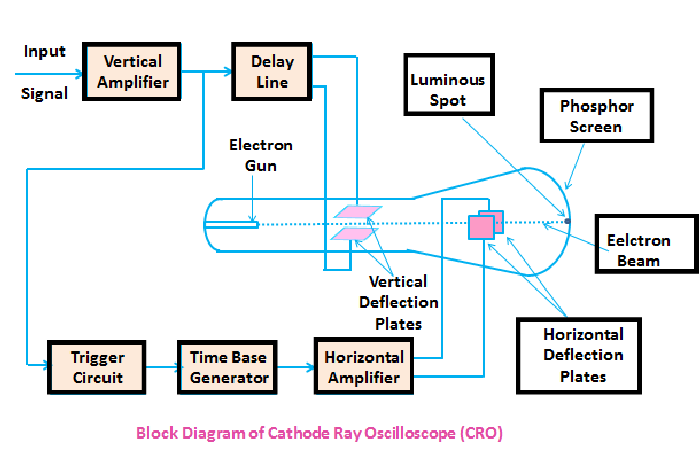
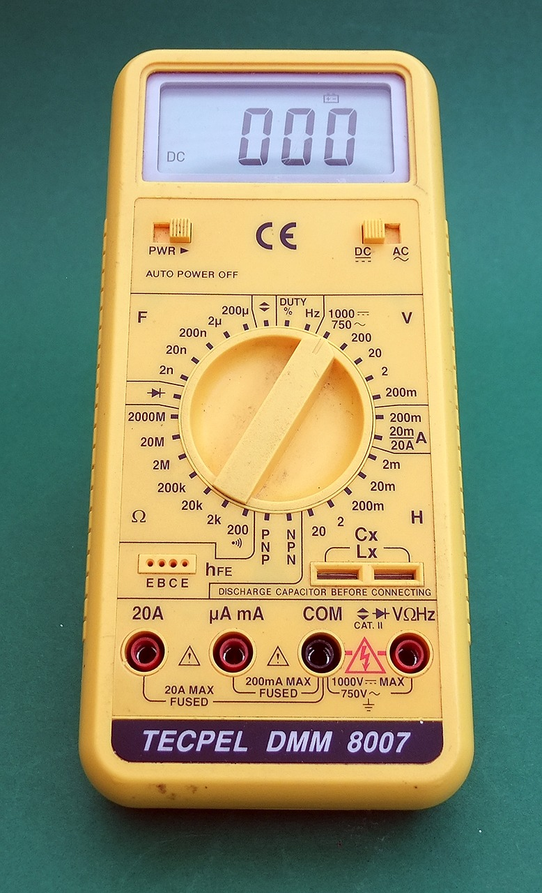
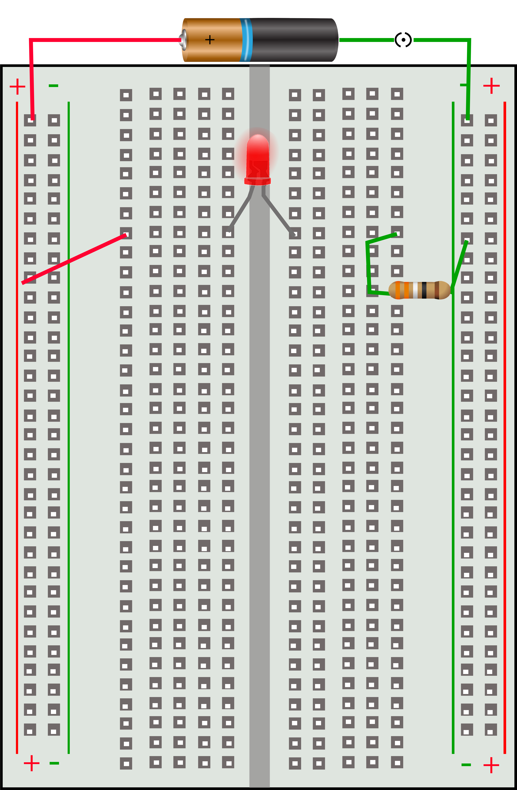

## Theory

#### CRO(Cathode Ray Oscilloscope

The Cathode Ray oscilloscope is one of the most important electronic instruments available for making circuit measurements. It displays a graph or curve plot of time-varying voltage on the oscilloscope screen. A dual trace oscilloscope is also looks like a real oscilloscope which helps the user to display and compare two time-varying voltages at one time.
The controls on the oscilloscope are as follows:
1. The CHANNEL A control adjusts the volts per division on the vertical axis for the channel A curve plot. The Y-POS control determines the vertical position of the channel A curve plot relative to the horizontal axis. Selecting AC places a capacitance between the channel A vertical input and the circuit testing point. Selecting “0” connects channel A vertical input to ground.
2. The CHANNEL B control adjusts the volts per division of the vertical axis for the channel B curve plot. The Y-POS determines the vertical position of the channel B curve plot relative to the horizontal axis. Selecting AC places a capacitance between the channel B vertical input and the circuit test point. Selecting “0” connects the channel B vertical input to ground.\
3. The TIME BASE control adjusts the time scale on the horizontal axis in time per division when Y/T is selected. When B/A is selected, the horizontal axis no longer represents time. The horizontal axis now represents the voltage on the channel A input and vertical axis represents the voltage on channel B input. When A/B is selected, the horizontal axis represents the voltage on the channel B input and the vertical axis represents the voltage on the channel A input. The X_POS control determines the horizontal position where the curve plot begins.
4. The trigger settings control the conditions under which a curve plot is triggered (begins to display). Triggering can be internal (based on one of the input signals) or external (based on a signal applied to the oscilloscope external trigger input). With internal triggering AUTO, A, or B. If A is selected, the curve plot will be triggered by channel A input signal. If B is selected, the curve plot will be triggered by channel B input signal. If you expect a flat input waveshape or you want the curve plot displayed as soon as possible, select AUTO. The display can be set to start on positive or negative slope of the input by selecting the appropriate EDGE selection.

 
 
#### Function Generator

The function generator is a voltage source that supplies different time-varying voltage functions.
The Multisim Electronics Workbench can supply sine wave, square wave, and triangular wave voltage functions. The wave shape, frequency, amplitude, and dc offset can be easily changed. It has three voltage output terminals. Connect the COM terminal to ground symbol. The +ve terminal provides output voltage that is positive with respect to the COM terminal and the –ve terminal proves an output voltage that is negative with respect
to the COM terminal.
The controls on the function generator are as follows:
1. User can select a wave shape by clicking the appropriate wave shape button on the top of the function generator.
2. AMPLITUDE control allows you to adjust the amplitude of the output voltage measured from the reference level (common) to peak level. The peak to peak value is twice the amplitude setting.
3. frequency control allows you adjust the frequency of the output voltage up to 999 MHz. Click up or down arrow to adjust the frequency, or click the frequency box and type the desired frequency or user can also change by using slider.
4. OFFSET control adjusts the dc level of the voltage curve generated by the function generator. An offset of 0 positions the graph plot along the x-axis with an equal positive and negative voltage. A positive offset raises the graph plot above the x-axis and a negative offset lowers the curve plot below the x-axis.

#### Multimeter

A multimeter is also known as a Volt-Ohm meter, is an electronic measuring instrument that combines various measurement functions in one unit. A multimeter may include features such as the ability to measure voltage, current and resistance. Multimeters may use analog or digital circuits—analog multimeters (AMM) and digital multimeters (often abbreviated DMM or DVOM.) Analog instruments are generally based on a microammeter whose pointer moves over a scale calibrated for all the different measurements that can be made; digital instruments usually display digits or numbers, but may display a bar of a length proportional to the quantity being measured. A multimeter can be a hand-held device useful for basic fault finding and field service workbench instrument which can measure to a very high rate of accuracy. They can be used in a wide array of industrial and household devices such as electronic equipment, motor controls, domestic appliances, power supplies, and wiring systems.

 

#### Power Supply

A power supply is a device that allows to supplies electric power to one or more electric loads. This term is very commonly used to devices that convert one form of energy (Electrical) to another, though it may also refer to devices that convert another form of energy (mechanical, chemical, solar) to electrical energy. A regulated power supply is one that controls the output voltage or current to a specific value; the controlled value is held nearly constant despite variations in either load current or the voltage supplied by the power supply's energy source.

#### Active Elements & Passive Elements

The elements within a circuit will either control the flow of electric energy or respond to it. Those elements which control the flow of electric energy are known as active elements and those which dissipate or store the electric energy are passive elements.
Examples of passive devices would be diodes, switches and spark gaps. Examples of active devices are Transistors, Triacs, Varistors, Vacuum Tubes, relays, solenoids and piezo electric devices.

#### Breadboard

A breadboard (protoboard) is a construction base for prototyping of electronics. The term is commonly used to refer to solderless breadboard. Because the solderless breadboard does not require soldering, it is reusable. This makes it easy to use for creating temporary prototypes and experimenting with circuit design.

 

