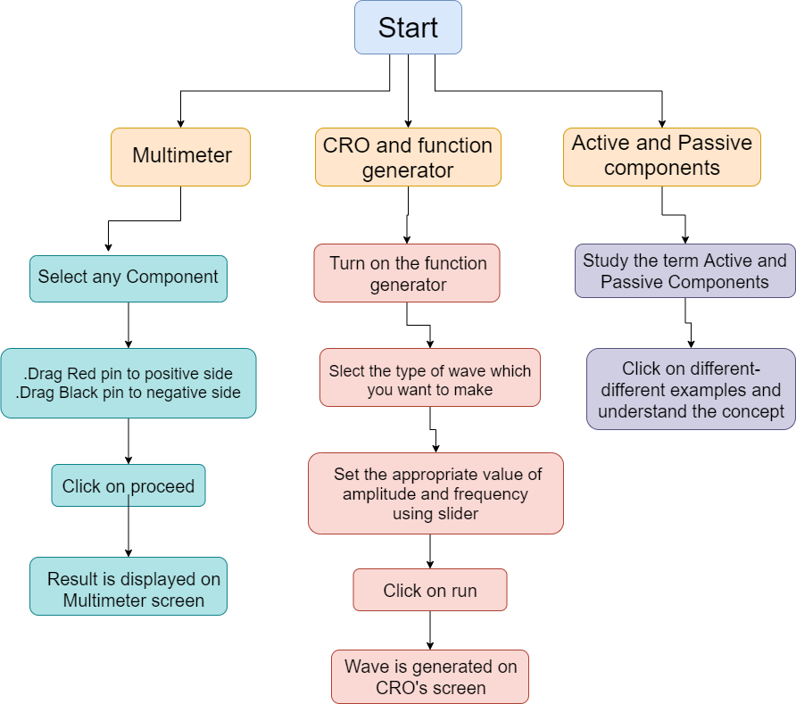
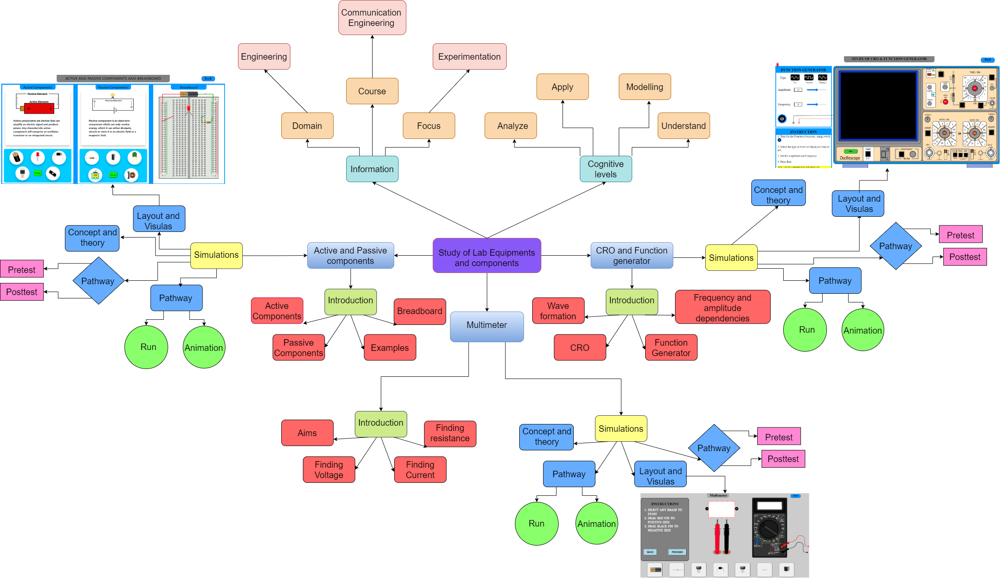

## Storyboard (Round 2)

Experiment 1: Study of Lab Equipment and Components: CRO, multimeter, and function generator, power supply- active, passive components and bread board.

### 1. Story Outline:

The experiment is based on the concept of some lab equipment and components i.e. Multimeter (an electronic instrument that measures voltage, resistance, current ), CRO and Function generator, Active and Passive components, and Breadboard. Students approach the simulator to understand the basic study of these types of equipment, their working, their uses, how CRO generates waves (sin, cos, square), the basic difference between Active and Passive components with respective examples. The objective of this experiment to get familiar with the basic electronic instrument and Equipment handling and usage procedure for Digital Multimeter, DC power supply, Function Generator, and CRO.

### 2. Story:

This Simulator is designed to study various Lab equipment and Components, like CRO, function generator, Multimeter, and power supply- active, passive components, and breadboard.
Step 1:- When the user visits the simulator it will interact with the first page, on top "Aim" will be displayed and below it, There are three-tab will be shown in which a short description of each simulator is placed.
Step 2:- Bottom of each tab a "Go" button will be displayed which will take you to the respective simulator.

Step 3:- Multimeter Simulator:- 
Step 3.1:- After the landing on this simulator (Multimeter), the user interacts with the page and some animation to understand the multimeter. 
Step 3.2:- Left of the page some instruction will be displayed and right of the page a dummy image of the multimeter will be shown, and bottom of the page there are some components which will be tested afterward.
Step 3.3:- User is experimenting as per as given instruction, the value of each component will be display on the screen of the multimeter after experimenting.

Step 4:- CRO and Function generator Simulator:-
Step 4.1:- In this Simulator user can visualize how waveform depends on the frequency and its amplitude.
Step 4.2:- On the left side there are two panels first one function Generator and the second one for instruction, using the function generator user can select the type of wave after that user will have to select frequency and amplitude and go with a run.
Step 4.3:- On the right side the dummy image of CRO is displaced and the user can easily be viewed the wave on-screen on CRO.
Step 4.4:- When the user hover on the dummy image of CRO user can easily see its function.

Step 5:- Active and Passive components and breadboard.
Step 5.1:- When the user enters this page they saw three panels first one for Active components, the Second for Passive components, and the third for Breadboard.
Step 5.2:- User can get far better information regarding elements with corresponding examples.

#### 2.1 Set the Visual Stage Description:
When the students visit the link of the simulator, they will see Aim placed on top of the page, and a three-tab is shown below it. The first one for Multimeter and the second one CRO and Function generator and the last one for Active and passive components.

** Mutimeter **
The left side of the screen is occupied by the Instruction tab where two buttons are provided for 'Back' and 'Proceed'. The right side of the screen is occupied by the dummy Multimeter and the result is displayed on the screen of a multimeter. Middle on-screen is occupied by two things first for two pins, black and red, and second for components placed after selection. Below all these things seven components are displayed, where students can choose any one of them.

** CRO and Function Generator **
The left side of the screen is divided into two parts first for the Function generator and second, for Instructions and the right side is occupied by dummy CRO where the wave or curve is generated as per as data given by the user in the function generator. In the function generator, there are three buttons to select the type of wave  and two sliders one for Amplitude and the second for Frequency.

** Active and Passive Components **
The whole screen is divided into three equal parts left side is occupied by Active components and Middle part is occupied by Passive components and the right side is occupied by Breadboard. In the left and middle parts, there are definition is displayed at the top with a suitable diagram, and five examples are shown below of them. Students can click on every example to understand it much better.

#### 2.2 Set User Objectives & Goals:
1. To get familiar with basic electronic instrument and Equipment handling and usage procedure for Digital Multimeter, DC power supply, Function Generator and CRO.
2. To study the self test / calibration procedure of CRO.
3. To study the function and operation of regulated power supply. 
4. To introduce the basic structure of a cathode-ray Oscilloscope.
5. To get familiar with the use of different control switches of the device.
6. To visualize an ac signal, measure the amplitude and the frequency.
7. To understand the concept of Active and passive components and breadboard.

#### 2.3 Set the Pathway Activities:

Students stands on the screen where he/she can go on three different ways first one for multimeter, second one for CRO and Function generator, and last for Active and Passive Components:-
** Multimeter **:-
1. Select any component from the list given below of screen.
2. Drag red pin to positive side.
3. Drag black pin to negative side.
4. Click on button proceed.
5. Result is displayed on multimeter screen.
6. Students can go back also and perform with another components.

** CRO and Function generator **
1. Click on start button provide left of the function generator, which turn on the CRO screen also.
2. Select the wave (sin, cos, square) which you want to make.
3. Select the appropriate value of amplitude and frequency.
4. Click on 'Run'.
5. Result is clearly visible on CRO's screen. A wave is draw as per as given values of amplitude and frequency.

** Active and Passive Components **
1. This simulator is for understand purpose, students can get knowledge about Active and passive components as well as breadboard.

##### 2.4 Set Challenges and Questions/Complexity/Variations in Questions:

Formative Assessment Questions
As mentioned in Round 1:

Difficulty Level: Recall
 Q) An Electronic Components which can process the signals are called?
 	a) Active Components
 	b) Passive Components
 	c) None of these
 	d) Both A and B
 Ans : (a)

 Q) The conductive metal strips on a breadboard
 	a) Contain buss strips commonly used for power connections
 	b) Provide socket strips in the build area to hold components
 	c) Are conductive with low resistance
 	d) All of these
 Ans : (d)

Difficulty Level: Understand
 Q) Continuous Time Fourier Series will be applicable for......?
 a) Periodic Signal
 b) Aperiodic Signal
 c) Causal Signal
 d) None of these
 Ans : (a)

Difficulty Level: Apply
 Q) The output impedance of a transistor connected in ……………. arrangement is the highest
 	a) common emitter
 	b) common collector
 	c) common base
 	d) None of the above
 Ans : (c)

Difficulty Level: Analyze
 Q) Electronic multimeter measures ____
 	a) voltage, current and resistance
 	b) voltage and current
     c) current and power
     d) energy and power
 Ans : (a)

##### 2.5 Allow pitfalls:
The pitfall means any error or limitation occurred while doing an experiment. So, in this experiment students do not need to worry about any pitfall. The output will be generated for each provided input. The student has to observe which values or the change in values are useful for them to obtain the required result. As the application provides real-time results, so the student can directly observe the generated result in the screen. This simulator is basically to understand about basic electronic instrument and Equipment handling and usage procedure. 

##### 2.6 Conclusion:
Time is taken by the student to attempt the questions: --10 minutes The student correctly answered: -----5 At the completion of this experiment, the following are the interpretations/ conclusions There are 10 questions with different difficulty levels. Assessment/evaluation of the multiple-choice questions will be given immediately to the student. When the student clicks on the answer of his choice, the correct answer will be displayed below the question. This would enable the student to understand whether he is right or wrong. The approximate time required to understand the procedure to perform the experiment would take about 05 min. To generate data will take another 5 minutes. Calculating and entering the values in the observation table will take approximately 05 minutes. Answering the assessment questions will take about 5 min. Thus the total time required to perform the experiment will require around 20 minutes.

##### 2.7 Equations/formulas: NA
Basically there is neither any equation nor any formula used in this simulator.

### 3. Flowchart 4
 
link to flow chart Here : Store in the  /flowchart folder within Round2 folder in your repo
 
(guide :The lab proposer should extract logic from the story, prepare a flowchart from the story narration and write the algorithm to execute the black box.  use Google Drawings https://docs.google.com/drawings/ (send the link to your flowchart and also attach .png by exporting it )

### 4. Mindmap:

 Link to mindmap here : Store the mindmap in both .mm & .png extension in the  /mindmap folder and include link of only .pdf verison here
  
 (guide : An elaborate mind map (connecting all the points in the experiment flow ) should be prepared and submitted by the lab proposer. The mind map should be a clear and detailed document that takes into account all minute intri5acies involved in the development of virtual lab. The mindmap should be self-content and any developer across the globe should be able to code it with all those details. using only FreeMind http://freemind.sourceforge.net/wiki/index.php/Main_Page (send the .png file and also the original .mm extension project file. )

### 5. Storyboard :
Storyboard: <a href="Storyboard/storyboard.gif"> [here]</a>
Link to storybaord (.gif file ) here :
(guide: This document should include sketching and description scene wise (duration, action, description). Software to be used for storyboarding : https://wonderunit.com/storyboarder/ (Its a FOSS tool) . tutorial on how to use it https://www.youtube.com/watch?v=LAeCEpG0KX4
